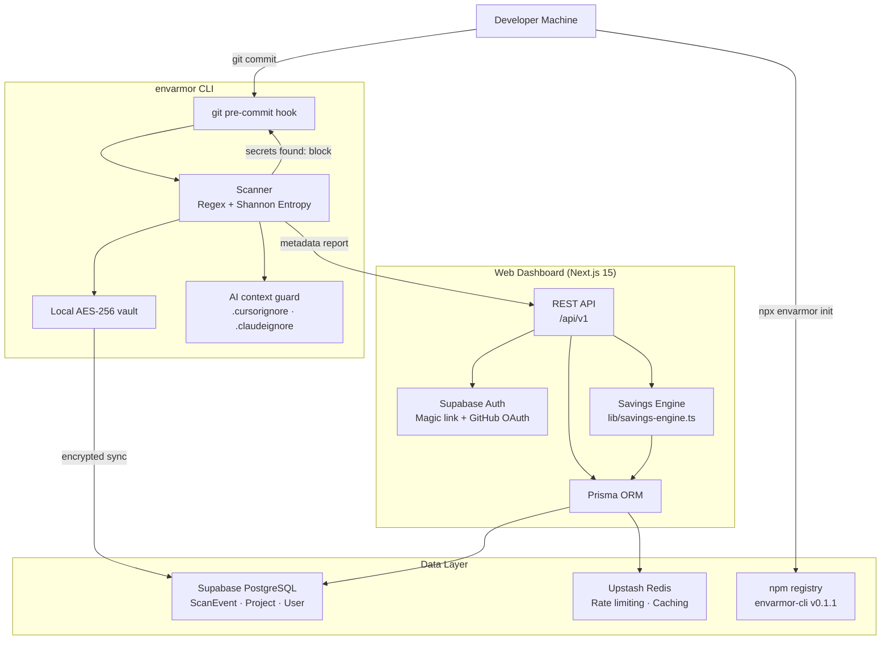

# EnvArmor — Secret Leak Prevention Suite

EnvArmor stops API keys, credentials, and environment variables from leaking into git history, AI context windows, or public deployments. It runs as two things: a CLI scanner that hooks into `git commit` and blocks pushes before secrets leave your machine, and a web dashboard where you can track scan history, review financial risk projections, and manage encrypted variables without passing `.env` files over Slack.

---

## The Problem vs. The Fix

| The Problem | How EnvArmor handles it |
| :--- | :--- |
| Secrets leaked in `.env` files or git history | Pre-commit hook blocks the push before it happens |
| Codebase ingested by AI tools (Cursor, Copilot, Claude) | Auto-generates `.cursorignore`, `.claudeignore`, `copilot-instructions.md` |
| No visibility into which leaked key costs the most | Maps detected keys to real abuse cost ranges (e.g. `$200–$5,000`) |
| Syncing `.env.local` files over Slack or email | AES-256 encrypted vault with cloud sync — no plaintext in transit |

---

## Architecture



---

## Tech Stack

### Web Dashboard
- **Framework:** Next.js 15 (App Router)
- **Auth:** Supabase (Magic Links + GitHub OAuth)
- **Database:** Prisma ORM + Supabase PostgreSQL
- **Caching:** Upstash Redis
- **Animations:** Framer Motion
- **Charts:** Recharts
- **Styling:** Vanilla CSS + Tailwind

### CLI
- **Runtime:** TypeScript + Node.js
- **Commands:** Commander.js
- **Output:** Chalk
- **Detection:** Regex pattern signatures + Shannon Entropy analysis + context verification
- **Vault:** AES-256 local encryption before cloud sync

---

## Setup

### Option 1 — Run the full stack locally (dashboard + CLI)

**1. Clone and install**
```bash
git clone https://github.com/AliRana30/EnvArmor.git
cd EnvArmor
npm install
```

**2. Configure environment**
```bash
cp .env.example .env
# Fill in your Supabase URL, anon key, and database URL
```

**3. Run database migrations**
```bash
npx prisma migrate dev
```

**4. Start the dashboard**
```bash
npm run dev
# Runs at http://localhost:3000
```

**5. Build and link the CLI**
```bash
cd envarmor
npm install
npm run build
npm link
```

**6. Authenticate the CLI**
- Copy your API key from `http://localhost:3000/settings`
- Run:
```bash
envarmor login --key "YOUR_API_KEY_HERE"
# Defaults to http://localhost:3000/api/v1
# Override with ENVARMOR_API_BASE_URL if needed
```

**7. Scan a repo**
```bash
envarmor scan -all
```

---

### Option 2 — Use the published npm package directly

```bash
npm install envarmor
npx envarmor init
```

`init` creates `.envarmor`, `.envarmorignore`, and wires the pre-commit hook automatically.

**Programmatic usage**
```typescript
import { ScannerEngine } from 'envarmor/src/engine.js';
import { RegexDetector, EntropyDetector } from 'envarmor/src/detectors.js';

const engine = new ScannerEngine({
  cwd: process.cwd(),
  detectors: [new RegexDetector(), new EntropyDetector()]
});

const result = await engine.scan();
console.log(`Scanned ${result.filesScanned} files. Found ${result.findings.length} secrets.`);
```

**Direct CLI via npx**
```bash
npx envarmor scan --all
npx envarmor protect
npx envarmor pull --env development
```

---

## Command Reference

| Command | Flags | What it does |
| :--- | :--- | :--- |
| `envarmor init` | — | Installs the pre-commit hook and creates local config |
| `envarmor scan` | `-all` · `--staged` · `--history` · `-p <slug>` | Scans all files, staged files only, or full git history |
| `envarmor login` | `--key <api-key>` | Links the CLI to your dashboard account |
| `envarmor protect` | — | Generates `.cursorignore`, `.claudeignore`, `.aiexclude`, and updates `.gitignore` |
| `envarmor audit-ai` | — | Checks whether active AI extensions can read your secrets |
| `envarmor sanitize` | `<text>` | Redacts detected secrets from a text string |
| `envarmor push` | `--env <env>` · `--force` · `-p <slug>` | Uploads `.env.local` variables to the encrypted vault |
| `envarmor pull` | `--env <env>` · `--output <out>` · `-p <slug>` | Pulls secrets from the vault to shell or file |
| `envarmor uninstall` | — | Removes the pre-commit hook and cleans local config |

**CI usage**
```bash
npx envarmor scan --ci --fail-on-high
```
Exits non-zero on `HIGH` or `CRITICAL` findings — drop it into any GitHub Actions workflow.

---

## Global Git Hook (optional)

To protect every repository on your machine without running `init` per project:

```bash
mkdir -p ~/.git-templates/hooks
cp .git/hooks/pre-commit ~/.git-templates/hooks/pre-commit
git config --global init.templatedir '~/.git-templates'
git config --global core.hooksPath ~/.git-templates/hooks
```

New repos inherit the hook automatically.

---

## Why it's built this way

**Local-first scanning.** The scanner runs entirely on your machine. Only lightweight metadata (file name, severity, secret type) goes to the dashboard — never the secret itself.

**Shannon Entropy + Regex.** Regex catches known key formats (Stripe `sk_live_`, AWS `AKIA`, OpenAI `sk-`). Entropy analysis catches unknown high-randomness strings that pattern-matching misses. Together they cover both structured and unstructured leaks.

**Financial risk, not just severity labels.** A `CRITICAL` badge doesn't tell you much. Mapping a leaked Stripe key to `$200–$5,000` in potential abuse costs makes the remediation priority obvious.

**Encrypted vault.** Variables encrypt on-device before any network request. The server never sees plaintext.

---

<p>Made with ❤️ by <a href="https://github.com/AliRana30">Ali Mahmood Rana</a></p>